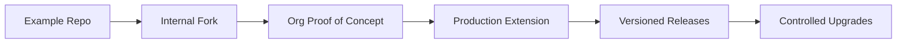
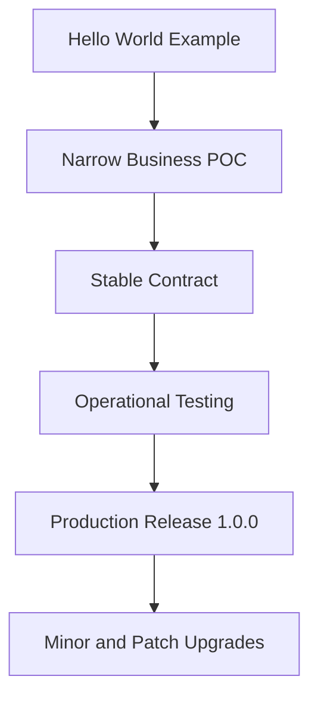

# Versioning and Upgrade Guide

This guide helps extension authors evolve the examples in this repository into production-ready Valtren AI extension packs.

## Start with a versioning contract

Treat every extension as a product with three moving parts:

- the extension package version
- the runtime or deployment model
- the organizational rollout plan

At minimum, every production extension should track:

- extension name
- semantic version
- supported runtime model
- supported Valtren AI version range
- upgrade notes
- rollback notes

## Recommended versioning model

Use semantic versioning for extension packages:

- `MAJOR`
  - breaking manifest changes
  - breaking API changes
  - removed workflows, routes, or executor behavior
- `MINOR`
  - backward-compatible new features
  - new templates, routes, or optional capabilities
- `PATCH`
  - bug fixes
  - documentation cleanup
  - backward-compatible validation or scoring improvements

Example:

- `0.1.0`
  - first usable internal pack
- `0.2.0`
  - adds new optional workflow or endpoint
- `1.0.0`
  - stable contract for wider production rollout

## Recommended upgrade path

### Stage 1: fork the example

Start by copying or forking the closest sample from `extension-examples`.

Do this first:

- rename the extension clearly
- replace placeholder descriptions
- narrow the business scope to one concrete problem
- document the expected inputs and outputs

### Stage 2: stabilize the contract

Before broad rollout, define a stable contract for:

- route names
- request and response fields
- workflow step outputs
- capability declarations
- health or smoke-test behavior

This is where many teams should cut `0.1.x` and `0.2.x` releases.

### Stage 3: prepare production rollout

Before calling the pack production-ready, add:

- changelog entries
- release notes
- upgrade notes
- rollback instructions
- environment and secret requirements
- health-check expectations

## What to change carefully

Be extra careful when changing:

- workflow keys
- template keys
- route paths
- step executor keys
- manifest-level capabilities
- response field names consumed by other systems

These are the most likely changes to break existing org configurations.

## Upgrade strategy by extension type

### In-process Node pack

Use this when:

- you are upgrading workflows, templates, or step executors

Recommended rollout:

1. release `PATCH` for bug fixes only
2. release `MINOR` when adding optional templates or workflows
3. release `MAJOR` if removing or renaming workflow keys

### Org ZIP extension

Use this when:

- the customer owns the extension package directly

Recommended rollout:

1. keep the ZIP package simple
2. version the ZIP contents explicitly in README and package metadata
3. upload new versions as reviewable packages
4. validate and smoke-test before enabling the new version
5. keep rollback ZIPs available

### Sidecar service

Use this when:

- runtime isolation matters
- the service evolves independently of Valtren core

Recommended rollout:

1. version the sidecar image or artifact
2. version the API contract separately if needed
3. add `/health` and optionally `/version`
4. deploy canary or staging first
5. only then point Valtren workflows at the newer version

## Release checklist

Before each release:

- update the version number
- update `CHANGELOG.md`
- verify docs and examples still match behavior
- run at least one smoke test
- confirm required capabilities are still accurate
- confirm rollback path is documented

## Upgrade checklist for customers

When upgrading an installed extension:

- read release notes
- review capability changes
- review any new secrets or config
- test in a non-production org or environment first
- confirm the smoke test passes
- keep the prior known-good version ready for rollback

## Rollback approach

Always assume one upgrade will eventually need rollback.

Keep:

- the previous release artifact
- the previous config
- the previous documented health baseline

Rollback should be able to answer:

- which version was live before
- which artifact to restore
- how to validate recovery

## Recommended repo hygiene

Every production-oriented extension should eventually include:

- `README.md`
- `CHANGELOG.md`
- versioned release tags
- runtime requirements
- sample requests or payloads
- health-check documentation

## A simple production progression

The goal is not to make the first extension big. The goal is to make it stable, understandable, and safe to upgrade.
